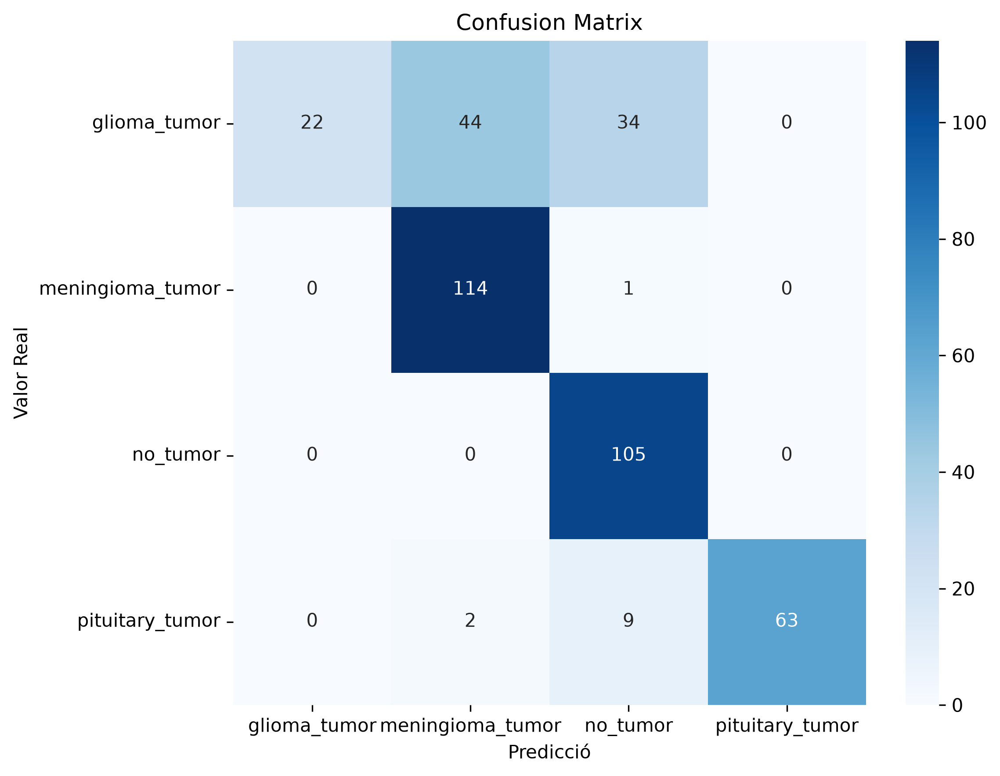

# Brain Tumor Classification using Deep Learning
A Deep Learning project for multiclass brain tumor classification from MRI images using Transfer Learning with ResNet50 and PyTorch.

The application includes:

- Training pipeline
- Evaluation metrics
- Inference script
- Interactive Gradio web application
## Demo


## Project Overview

The objective of this project is to classify brain MRI images into four different categories:

- Glioma Tumor
- Meningioma Tumor
- No Tumor
- Pituitary Tumor

The model is based on Transfer Learning using ResNet50 pretrained on ImageNet.

## Dataset

Dataset used:

Brain MRI Images for Brain Tumor Detection

Source:

https://www.kaggle.com/datasets/sartajbhuvaji/brain-tumor-classification-mri

Classes:

- glioma_tumor
- meningioma_tumor
- no_tumor
- pituitary_tumor

## Model

Architecture:

ResNet50

Transfer Learning

PyTorch

CrossEntropyLoss

Adam Optimizer

Early Stopping

Learning Rate Scheduler

## Project Structure

```text
projecte1/
│
├── app.py
├── configs/
├── data/
├── images/
├── models/
├── results/
├── src/
│   ├── dataset.py
│   ├── model.py
│   ├── train.py
│   ├── evaluate.py
│   └── inference.py
├── README.MD
└── requirements.txt
```

## Installation

Clone repository

```bash
git clone https://github.com/bielvicens/Brain-Tumor-Classification-using-Deep-Learning-MRI-.git
```

Create virtual environment

```bash
python -m venv venv
```

Activate

Windows

```bash
venv\Scripts\activate
```

Install dependencies

```bash
pip install -r requirements.txt
```

## Training

```bash
python src/train.py
```

## Evaluation

```bash
python src/evaluate.py
```

## Inference

```bash
python src/inference.py data/test.jpg
```

## Web Application

```bash
python app.py
```

Then open

http://127.0.0.1:7860

## Results

Validation Accuracy

96.69%

Test Accuracy

77.16%

### Confusion Matrix



## Improvements

During development several improvements were introduced:

- Data augmentation
- Validation split
- Early Stopping
- Learning Rate Scheduler
- Weight Decay
- Transfer Learning
- CUDA support
- Automatic best model saving
- Confusion Matrix
- Classification Report
- Gradio Application

## Limitations

The dataset is relatively small and presents class imbalance.

The model performs well for Meningioma, Pituitary and No Tumor images but struggles to correctly identify Glioma tumors.

## Future Work

- Fine-tuning all ResNet layers
- Larger MRI datasets
- EfficientNet implementation
- Vision Transformers
- Explainable AI using Grad-CAM
- Deployment on HuggingFace Spaces

## Technologies

- Python
- PyTorch
- Torchvision
- CUDA
- Gradio
- Scikit-Learn
- Matplotlib
- NumPy

## Author

Biel Vicens Boix

Biomedical Engineering

University of Girona

## License

MIT License